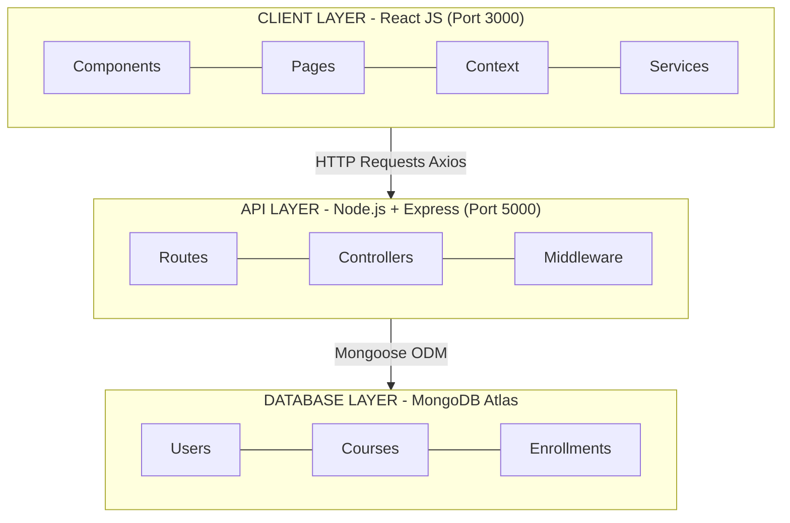
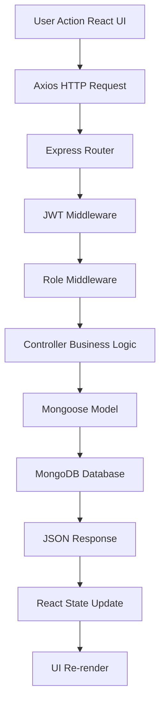
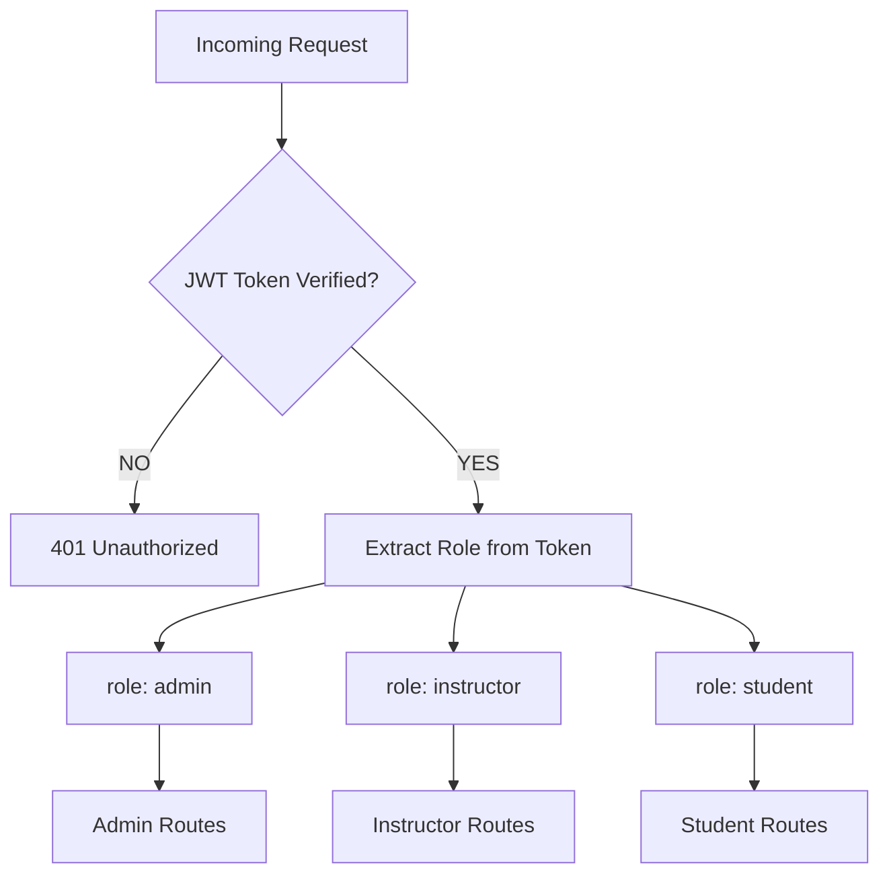
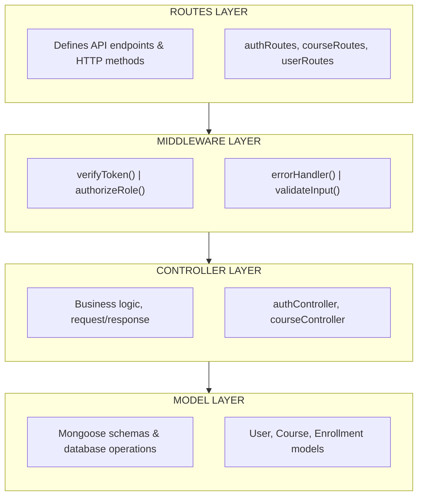
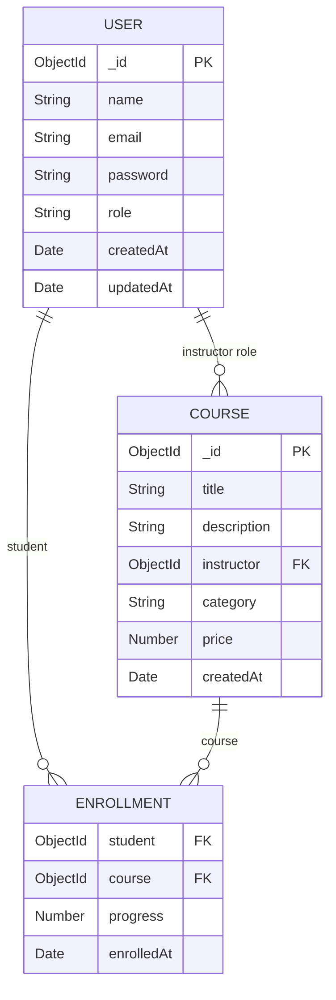
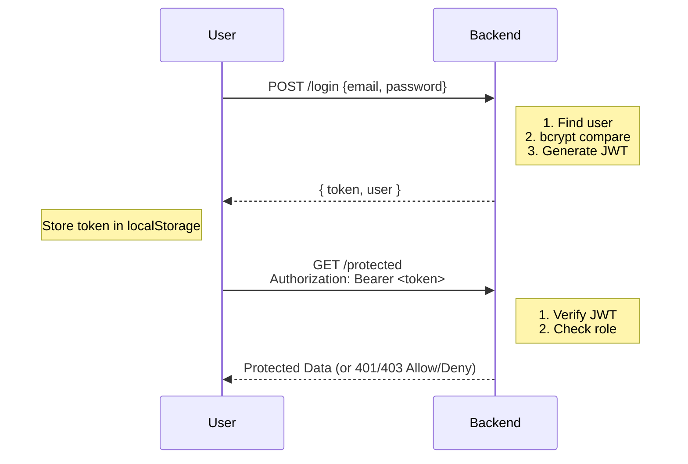

# 📚 Full Fledged MERN Stack Learning Management System

> **Course:** MERN Stack Web Development  
> **Assessment Type:** Final Project (Full Stack Application)  
> **Total Marks:** 100  
> **Author:** Muhammad Abdullah Siddique

---

## 📌 Table of Contents

- [Project Overview](#-project-overview)
- [System Architecture](#-system-architecture)
- [Technologies Used](#-technologies-used)
- [User Roles](#-user-roles)
- [Frontend Architecture](#-frontend-architecture)
- [Backend Architecture](#-backend-architecture)
- [Database Design](#-database-design)
- [Authentication & Security](#-authentication--security)
- [API Reference](#-api-reference)
- [Folder Structure](#-folder-structure)
- [Getting Started](#-getting-started)
- [Deployment](#-deployment)
- [Marking Scheme](#-marking-scheme)
- [Screenshots](#-screenshots)

---

## 📖 Project Overview

The **Full Fledged MERN Stack Learning Management System (LMS)** is a modern, full-stack web application built using the MERN architecture. It serves as a complete educational platform where:

- 🎓 **Students** can register, browse courses, enroll, and track their learning progress
- 👨‍🏫 **Instructors** can create, manage, and upload course content
- 🛡️ **Admins** can manage users, courses, and view system analytics

This project reflects real-world industry standards including JWT authentication, role-based access control, RESTful APIs, and a clean modular architecture.

---

## 🏗️ System Architecture



### Request Flow Diagram



---

## 🛠️ Technologies Used

### Frontend

| Technology | Purpose |
|-----------|---------|
| React JS | UI component library |
| React Router DOM | Client-side routing / SPA navigation |
| Axios | HTTP requests to backend APIs |
| Bootstrap / React Bootstrap | Responsive UI styling |
| CSS3 | Custom styling |
| Context API | Global state management |

### Backend

| Technology | Purpose |
|-----------|---------|
| Node.js | JavaScript runtime environment |
| Express.js | Web framework for REST APIs |
| MongoDB | NoSQL database |
| Mongoose | MongoDB object modeling (ODM) |
| JWT (jsonwebtoken) | Token-based authentication |
| Bcrypt | Password hashing |
| Dotenv | Environment variable management |
| Nodemon | Auto-restart during development |
| CORS | Cross-origin resource sharing |

---

## 👥 User Roles

The system implements **Role-Based Access Control (RBAC)** with three distinct roles:

| ADMIN | INSTRUCTOR | STUDENT |
|---|---|---|
| View all users | Create courses | Register & Login |
| Delete users | Edit courses | Browse courses |
| Manage courses | Delete courses | Enroll in courses |
| View analytics | Upload lessons | View enrolled courses |
| Full access | Manage content | Track progress |

### Role Authorization Flow



---

## 🖥️ Frontend Architecture

### Component Hierarchy

```
App.js
├── BrowserRouter
│   ├── Navbar (shared)
│   ├── Public Routes
│   │   ├── /           → Home.jsx
│   │   ├── /about      → About.jsx
│   │   ├── /courses    → Courses.jsx
│   │   ├── /courses/:id→ CourseDetail.jsx
│   │   ├── /login      → Login.jsx
│   │   └── /register   → Register.jsx
│   │
│   └── Protected Routes (JWT required)
│       ├── /student/dashboard   → StudentDashboard.jsx
│       ├── /student/my-courses  → MyCourses.jsx
│       ├── /student/profile     → Profile.jsx
│       ├── /instructor/dashboard→ InstructorDashboard.jsx
│       ├── /instructor/create   → CreateCourse.jsx
│       ├── /instructor/manage   → ManageCourses.jsx
│       ├── /admin/dashboard     → AdminDashboard.jsx
│       ├── /admin/users         → ManageUsers.jsx
│       └── /admin/analytics     → Analytics.jsx
└── Footer (shared)
```

### State Management

```
Context API
├── AuthContext
│   ├── user (object)
│   ├── token (string)
│   ├── login()
│   └── logout()
│
└── CourseContext
    ├── courses (array)
    ├── fetchCourses()
    └── enrollCourse()
```

### Folder Structure

```bash
frontend/
│
├── public/
│   ├── index.html
│   └── favicon.ico
│
└── src/
    ├── components/          # Reusable UI components
    │   ├── Navbar.jsx
    │   ├── Footer.jsx
    │   ├── CourseCard.jsx
    │   ├── Loader.jsx
    │   └── ProtectedRoute.jsx
    │
    ├── pages/               # Page-level components
    │   ├── Home.jsx
    │   ├── About.jsx
    │   ├── Courses.jsx
    │   ├── CourseDetail.jsx
    │   ├── Login.jsx
    │   ├── Register.jsx
    │   ├── StudentDashboard.jsx
    │   ├── InstructorDashboard.jsx
    │   └── AdminDashboard.jsx
    │
    ├── services/            # Axios API calls
    │   ├── authService.js
    │   ├── courseService.js
    │   └── enrollService.js
    │
    ├── context/             # Global state
    │   ├── AuthContext.js
    │   └── CourseContext.js
    │
    ├── routes/              # Route definitions
    │   └── AppRoutes.jsx
    │
    ├── App.js
    └── index.js
```

---

## ⚙️ Backend Architecture

### Layered Architecture



### Folder Structure

```bash
backend/
│
├── config/
│   └── db.js                # MongoDB connection
│
├── controllers/
│   ├── authController.js    # Register, Login logic
│   ├── courseController.js  # CRUD for courses
│   ├── userController.js    # User management
│   └── enrollController.js  # Enrollment logic
│
├── middleware/
│   ├── authMiddleware.js    # JWT verification
│   ├── roleMiddleware.js    # Role-based access
│   └── errorMiddleware.js   # Global error handler
│
├── models/
│   ├── User.js              # User schema
│   ├── Course.js            # Course schema
│   └── Enrollment.js        # Enrollment schema
│
├── routes/
│   ├── authRoutes.js        # /register, /login
│   ├── courseRoutes.js      # /courses CRUD
│   ├── userRoutes.js        # /users management
│   └── enrollRoutes.js      # /enroll, /my-courses
│
├── utils/
│   └── generateToken.js     # JWT token generator
│
├── .env                     # Environment variables
├── package.json
└── server.js                # Entry point
```

---

## 🗄️ Database Design

### Entity Relationship Diagram



### User Schema

```javascript
{
  name:      { type: String, required: true },
  email:     { type: String, required: true, unique: true },
  password:  { type: String, required: true },          // bcrypt hashed
  role:      { type: String, enum: ['student', 'instructor', 'admin'],
               default: 'student' },
  timestamps: true
}
```

### Course Schema

```javascript
{
  title:       { type: String, required: true },
  description: { type: String, required: true },
  instructor:  { type: mongoose.Schema.Types.ObjectId, ref: 'User' },
  category:    { type: String, required: true },
  price:       { type: Number, default: 0 },
  timestamps:  true
}
```

### Enrollment Schema

```javascript
{
  student:  { type: mongoose.Schema.Types.ObjectId, ref: 'User' },
  course:   { type: mongoose.Schema.Types.ObjectId, ref: 'Course' },
  progress: { type: Number, default: 0 },              // 0–100%
  timestamps: true
}
```

---

## 🔐 Authentication & Security

### Authentication Flow



### Security Features

| Feature | Implementation |
|---------|---------------|
| Password Hashing | bcrypt with salt rounds |
| Token Auth | JWT (jsonwebtoken) |
| Protected Routes | verifyToken middleware |
| Role Control | authorizeRole middleware |
| Env Variables | dotenv (.env file) |
| Input Validation | Express validators |
| Error Handling | Global error middleware |

---

## 🔌 API Reference

### Authentication

| Method | Endpoint | Access | Description |
|--------|----------|--------|-------------|
| POST | `/api/auth/register` | Public | Register new user |
| POST | `/api/auth/login` | Public | Login & get JWT token |

### Courses

| Method | Endpoint | Access | Description |
|--------|----------|--------|-------------|
| GET | `/api/courses` | Public | Get all courses |
| POST | `/api/courses` | Instructor | Create new course |
| PUT | `/api/courses/:id` | Instructor | Update course |
| DELETE | `/api/courses/:id` | Instructor/Admin | Delete course |

### Users

| Method | Endpoint | Access | Description |
|--------|----------|--------|-------------|
| GET | `/api/users` | Admin | Get all users |
| DELETE | `/api/users/:id` | Admin | Delete a user |

### Enrollments

| Method | Endpoint | Access | Description |
|--------|----------|--------|-------------|
| POST | `/api/enroll` | Student | Enroll in a course |
| GET | `/api/my-courses` | Student | Get enrolled courses |

---

## 📁 Folder Structure (Complete)

```
LMS/
│
├── backend/
│   ├── config/
│   │   └── db.js
│   ├── controllers/
│   │   ├── authController.js
│   │   ├── courseController.js
│   │   ├── userController.js
│   │   └── enrollController.js
│   ├── middleware/
│   │   ├── authMiddleware.js
│   │   ├── roleMiddleware.js
│   │   └── errorMiddleware.js
│   ├── models/
│   │   ├── User.js
│   │   ├── Course.js
│   │   └── Enrollment.js
│   ├── routes/
│   │   ├── authRoutes.js
│   │   ├── courseRoutes.js
│   │   ├── userRoutes.js
│   │   └── enrollRoutes.js
│   ├── utils/
│   │   └── generateToken.js
│   ├── .env
│   ├── package.json
│   └── server.js
│
├── frontend/
│   └── frontend/
│       ├── public/
│       └── src/
│           ├── components/
│           ├── pages/
│           ├── services/
│           ├── context/
│           ├── routes/
│           ├── App.js
│           └── index.js
│
├── .gitignore
└── README.md
```

---

## 🚀 Getting Started

### Prerequisites

- Node.js v18+
- MongoDB Atlas account
- Git

### 1. Clone the Repository

```bash
git clone https://github.com/MuhammadAbdullahSiddiqueasdfas/LMS_Project.git
cd LMS_Project
```

### 2. Backend Setup

```bash
cd backend
npm install
```

Create a `.env` file in `backend/`:

```env
PORT=5000
MONGO_URI=your_mongodb_atlas_uri
JWT_SECRET=your_secret_key
```

Start the backend:

```bash
npm start
```

Backend runs at: `http://localhost:5000`

### 3. Frontend Setup

```bash
cd frontend/frontend
npm install
npm start
```

Frontend runs at: `http://localhost:3000`

---

## 🌐 Deployment

| Layer | Platform | URL |
|-------|----------|-----|
| Frontend | Vercel / Netlify | Auto-deploy from GitHub |
| Backend | Render / Railway | Connect GitHub repo |
| Database | MongoDB Atlas | Cloud-hosted cluster |

---

## 📊 Marking Scheme

| Criteria | Marks |
|----------|-------|
| UI/UX Design | 15 |
| React Implementation | 15 |
| Backend API Development | 20 |
| Database Design | 15 |
| Authentication & Security | 15 |
| Role-Based Functionality | 10 |
| Code Quality & Structure | 5 |
| Deployment & Testing | 5 |
| **Total** | **100** |

---

## 📷 Screenshots

> Add screenshots of the following modules:

| Module | Description |
|--------|-------------|
| Home Page | Landing page with course listings |
| Login / Register | Authentication forms |
| Student Dashboard | Enrolled courses & profile |
| Instructor Dashboard | Course management panel |
| Admin Dashboard | User management & analytics |

---

## 🧪 Testing

- API Testing via Postman
- Authentication flow testing
- Role-based access testing
- Frontend UI testing
- Database operation testing

---

## ❌ Important Instructions

- Plagiarism will result in **zero marks**
- Code must be properly structured
- Hard-coded credentials are **not allowed**
- Environment variables **must** be used
- Proper error handling is **mandatory**

---

## 🎯 Learning Outcomes

By completing this project, students demonstrate:

- ✅ Complete MERN stack development
- ✅ Full-stack frontend & backend integration
- ✅ RESTful API design & implementation
- ✅ JWT authentication & bcrypt security
- ✅ Role-based authorization
- ✅ MongoDB schema design
- ✅ Real-world project workflow
- ✅ Industry-level coding practices

---

## 📜 Student Declaration

> I confirm that this project is my own work and I have not copied it from any unauthorized source.

**Student Name:** Muhammad Abdullah Siddique  
**Date:** May 2026

---

## 📜 License

This project is developed for educational purposes under the **Hunarmand Punjab** MERN Stack Web Development course.
